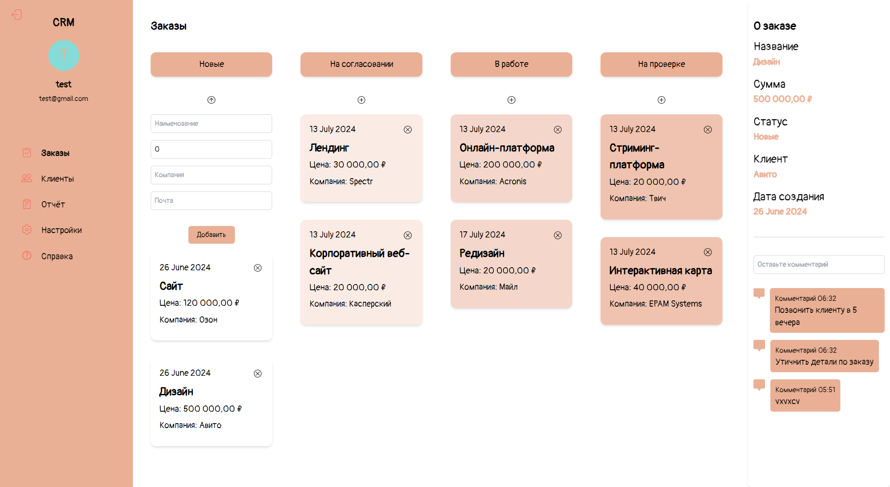
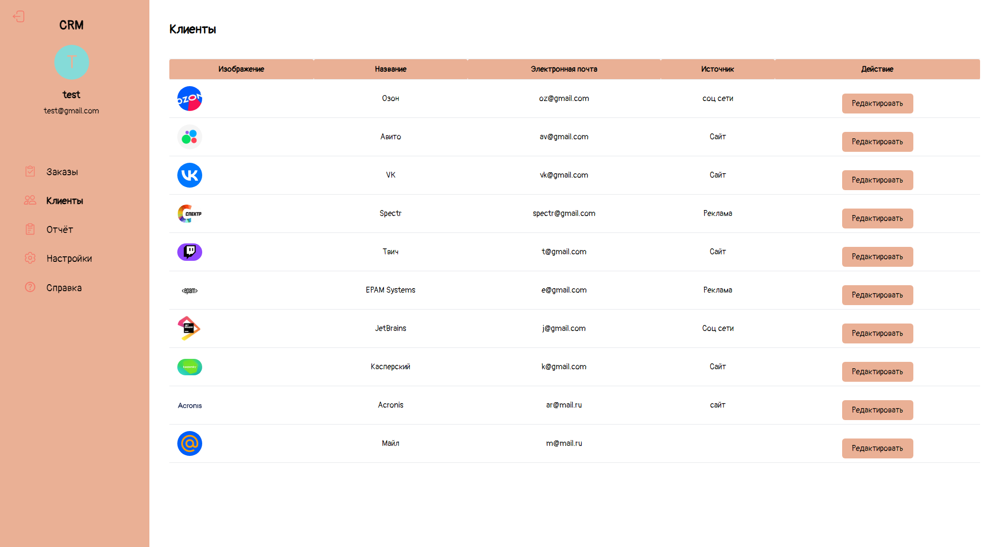
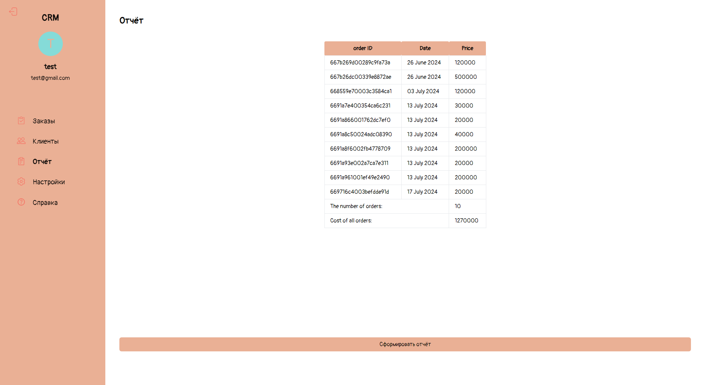
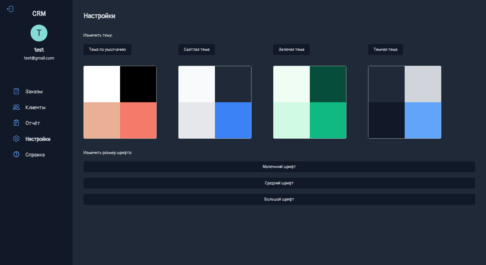
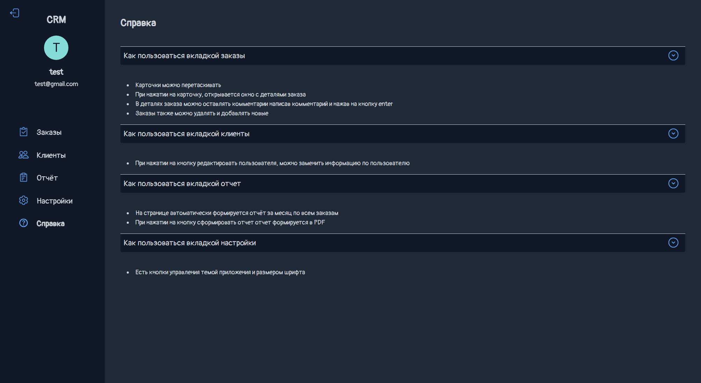

# [CRM-System](https://fabulous-entremet-6183f8.netlify.app/ "Ссылка на сайт")

# Содержание

1. <a href="#description">Описание проекта</a>
2. <a href="#setup">Настройка проекта</a>
3. <a href="#stack">Технологии</a>
4. <a href="#screenshots">Скриншоты сайта</a>

   
<h2 id="description">Описание проекта</h2>

CRM-Система для сотрудника. 

Основные функции сайта:

  1. Работа с реляционной бд/хранилищем.
  2. Регистрация/авторизация.
  3. Добавление/удаление/перетаскивание карточек заказа, добавление комментариев к заказам.
  4. Редактирование информации о клиентах.
  5. Автоматические составление отчета в формате PDF.
  6. Возможность смены темы и размера шрифта.

<h2 id="setup">Настройка проекта</h2>

### Установка
```
npm install
```

### Компилирует и выполняет перезагрузку для разработки
```
npm run dev
```

### Компилирует и минимизирует для продакшн
```
npm run build
```

<h2 id="stack">Технологии</h2>

   * Nuxt 3
   * Nuxt Icon/Image/Fonts/PDF
   * Tailwind
   * Pinia
   * Vue Query
   * Vuelidate
   * Appwrite

<h2 id="screenshots">Скриншоты сайта</h2>

1. Скриншот вкладки c заказами
 


2. Скриншот вкладки клиенты



3. Скриншот вкладки отчёт



4. Скриншот вкладки настроек



5. Скриншот вкладки помощь
 


